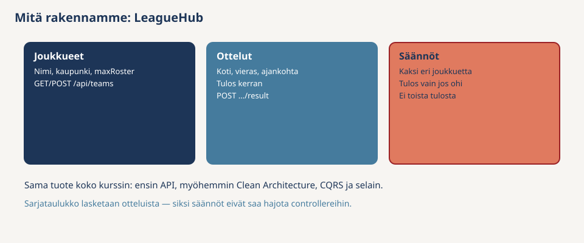
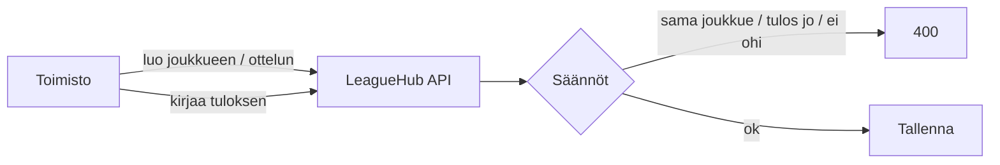
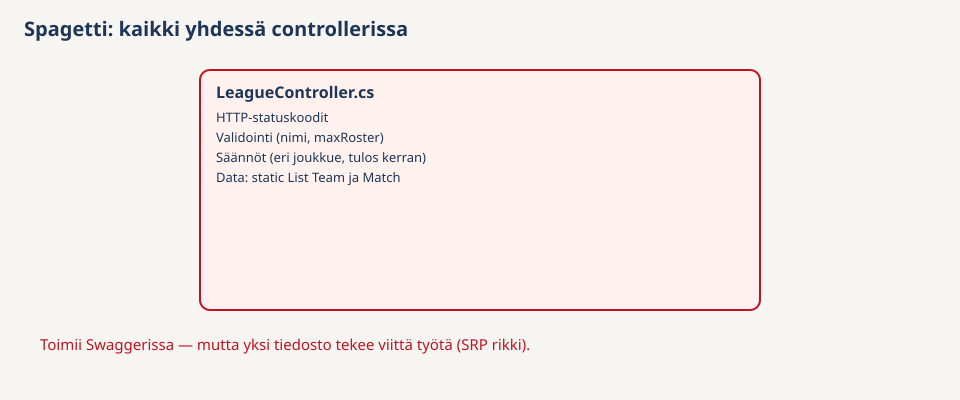
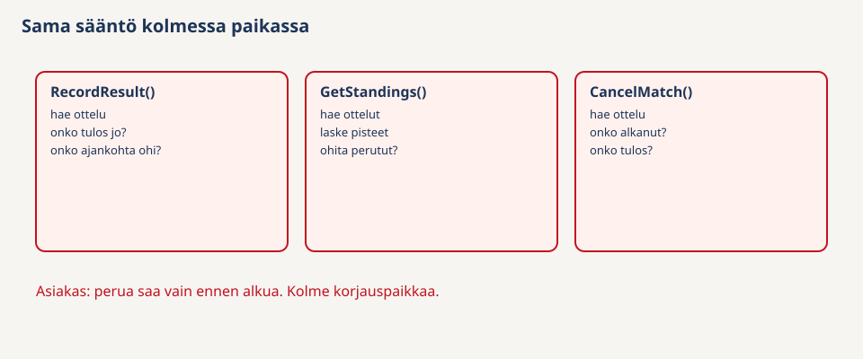
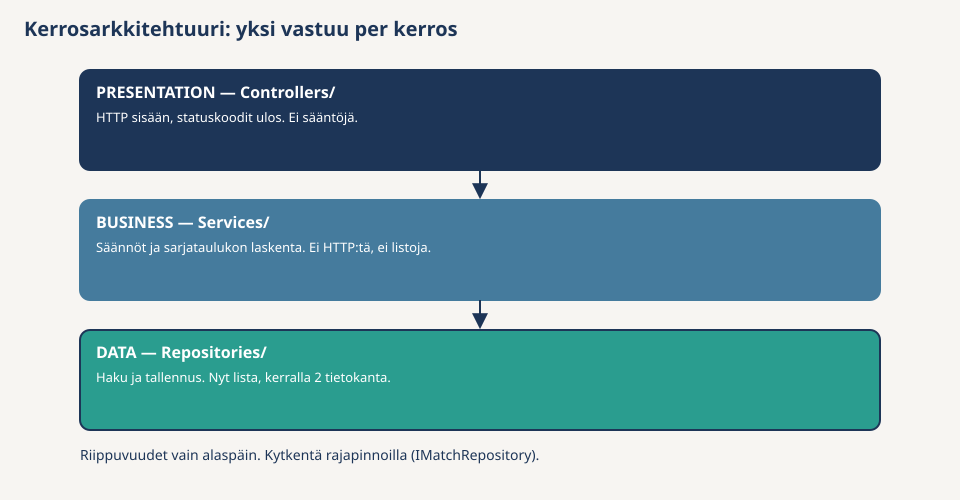
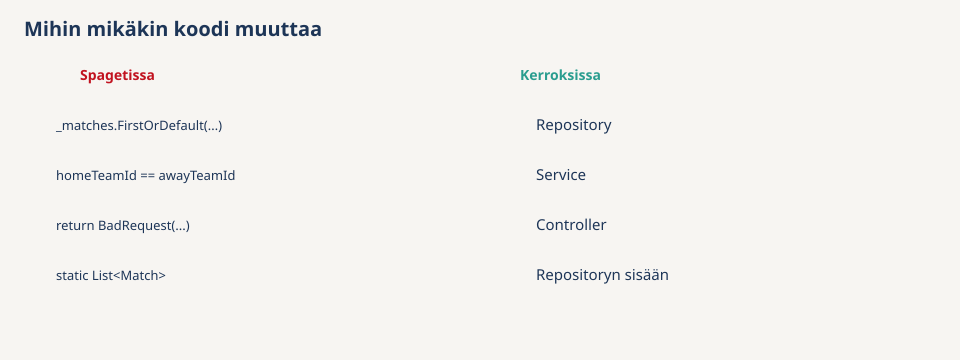
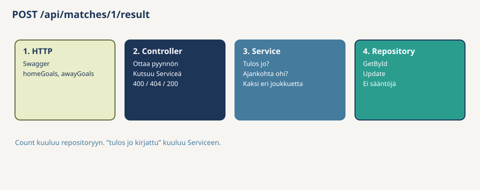
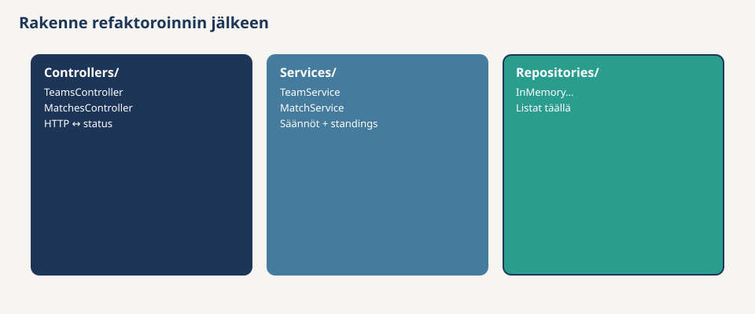
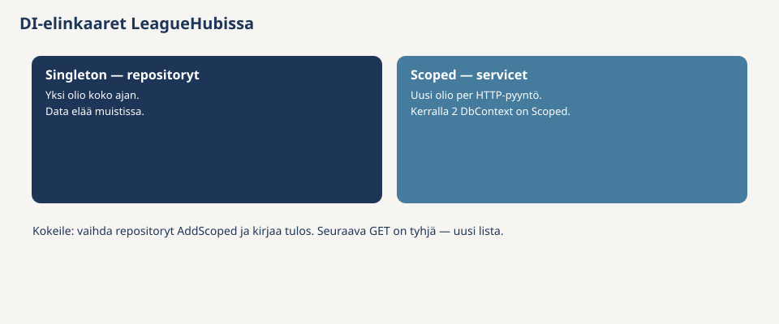
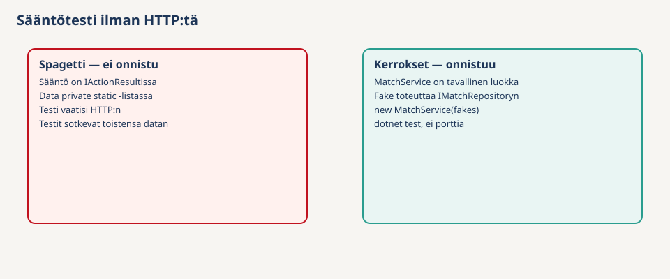

# Tehtävä 1: Kerrosarkkitehtuuri — spagetista rakenteeseen

Tervetuloa arkkitehtuurikurssin ensimmäiseen tehtävään. **Ennen koodia** lue esitys: mitä arkkitehtuuri on, millä tasoilla sitä katsotaan, ja miksi pilvi ja putket ovat arkkitehtuuria vaikka niitä ei tällä kurssilla rakenneta:

 **[Ohjelmistoarkkitehtuuri](../ohjelmistoarkkitehtuuri.md)**

Tässä tehtävässä aloitat kurssin **LeagueHub**-projektin — yhden lajin harrastesarjan (joukkueet, ottelut, tulos, sarjataulukko). Tarkastelutaso on sovellusarkkitehtuuri. [MyLeague](https://github.com/xamkfi/myleague-app) on referenssi, josta rakennamme kurssin aikana pienemmän version.

Rakennat ensin sovelluksen tarkoituksella **huonosti** (spagettina) ja näet, miksi sellaista on ikävä ylläpitää. Sitten refaktoroit saman sovelluksen **kerrosarkkitehtuuriin**.

> **Tärkeää:** Tätä tehtävää **ei palauteta**. 

---

## Tavoitteet

- Osaat selittää, mitä arkkitehtuuri tarkoittaa ja nimetä tarkastelutasoja — [Ohjelmistoarkkitehtuuri](../ohjelmistoarkkitehtuuri.md)
- Tunnistat spagettikoodin ongelmat omakohtaisesti
- Ymmärrät kolme kerrosta: Presentation (controller), Business (service), Data (repository)
- Osaat jakaa vastuut: Controller, Service, Repository
- Ymmärrät, miksi säännöt kuuluvat Serviceen eivätkä controlleriin
- Osaat käyttää rajapintoja ja konstruktori-injektiota
- Ymmärrät, miksi in-memory-repository on Singleton ja service Scoped
- Näet, miten kerrokset tekevät koodista testattavaa ilman HTTP:tä

---

## Mitä tarvitset?

- [.NET 8 SDK](https://dotnet.microsoft.com/download/dotnet/8.0) (tai uudempi)
- Visual Studio 2022, VS Code + C# Dev Kit tai Rider
- Git ja GitHub-repo

Esitiedot: Backend basics — controllerit, CRUD, `IActionResult`, Swagger.

---

## Lisämateriaali

- **[Ohjelmistoarkkitehtuuri](../ohjelmistoarkkitehtuuri.md)**
- [Layered Architecture](https://github.com/xamk-mire/Xamk-wiki/blob/main/C%23/fin/04-Advanced/Architecture/Layered-Architecture.md)
- [SOLID](https://github.com/xamk-mire/Xamk-wiki/blob/main/C%23/fin/04-Advanced/SOLID.md) (SRP ja DIP)
- [Dependency Injection](https://github.com/xamk-mire/Xamk-wiki/blob/main/C%23/fin/04-Advanced/Dependency-Injection.md)
- [Service-kerros ja DI](https://github.com/xamk-mire/Xamk-wiki/blob/main/C%23/fin/04-Advanced/WebAPI/Services-and-DI.md)

---

## Mitä rakennamme?

**LeagueHub** on kampuksen harrastesarjan API:

- luo ja selaa joukkueita (nimi, kaupunki, maxRoster)
- luo otteluita (koti, vieras, ajankohta)
- kirjaa tulos
- katso sarjataulukko (voitto 3 p, tasapeli 1 p)

| Sääntö | Selitys |
|--------|---------|
| Eri joukkueet | Koti ja vieras eivät ole sama joukkue |
| Tulos kerran | Kirjattua tulosta ei ylikirjoiteta |
| Ajankohta | Tulos vain jos ottelun ajankohta on ohi |
| Joukkue | Nimi ei tyhjä, maxRoster > 0 |





---

# Ohjattu osio

## Vaihe 1: Projektin luominen

### Miksi tämä vaihe?

Luodaan tuttu Web API -pohja. Tämä on kertausta Backend basicsista, jotta kaikilla on sama lähtö.

### Mitä tehdään?

Luo **ASP.NET Core Web API** -projekti nimellä `LeagueHub`. Käytä **controllereita** (ei Minimal APIa) ja pidä Swagger päällä. Poista `WeatherForecastController.cs` ja `WeatherForecast.cs`. Korvaa `Program.cs` alla olevalla, jotta kaikilla on sama lähtö.

Avaa se tapa jolla luot projektin:

<details>
<summary>Visual Studio</summary>

1. Avaa Visual Studio. Aloitusikkunassa valitse **Create a new project** (*Luo uusi projekti*).
2. Kirjoita hakuun `web api`. Kieleksi **C#**. Valitse malli **ASP.NET Core Web API** — ei *Blazor*, ei *gRPC*, ei *Empty*. Paina **Next**.
3. **Project name:** `LeagueHub`. **Location:** oma kurssikansio. Paina **Next**.
4. **Framework:** .NET 8 (tai uudempi LTS). Älä valitse Preview-versiota.
5. **Authentication type:** None.
6. Rastita **Configure for HTTPS** ja **Enable OpenAPI support** (Swagger).
7. Rastita **Use controllers** — ilman tätä saat Minimal APIn, joka ei ole tämän tehtävän pohja.
8. Jätä **.NET Aspire** pois. Paina **Create**.
9. Solution Explorerissa poista `Controllers/WeatherForecastController.cs` ja `WeatherForecast.cs`.
10. Avaa `Program.cs` ja korvaa sisältö alla olevalla.

> Jos mallia **ASP.NET Core Web API** ei näy, avaa **Visual Studio Installer** → *Modify* ja rastita työkuorma **ASP.NET and web development**. Pelkkä *.NET desktop development* riittää konsolille, ei Web APIlle.

</details>

<details>
<summary>Komentorivi (konsoli)</summary>

PowerShell tai terminaali, kansiossa johon haluat projektin:

```bash
dotnet new webapi -n LeagueHub --use-controllers
cd LeagueHub
```

`--use-controllers` on tärkeä: ilman sitä pohja on Minimal API.

Poista `Controllers/WeatherForecastController.cs` ja `WeatherForecast.cs`. Korvaa `Program.cs` alla olevalla.

</details>

Yhteinen `Program.cs`:

```csharp
WebApplicationBuilder builder = WebApplication.CreateBuilder(args);

builder.Services.AddControllers();
builder.Services.AddEndpointsApiExplorer();
builder.Services.AddSwaggerGen();

WebApplication app = builder.Build();

if (app.Environment.IsDevelopment())
{
    app.UseSwagger();
    app.UseSwaggerUI();
}

app.UseHttpsRedirection();
app.MapControllers();

app.Run();
```

Git (komentorivillä projektikansiossa, tai Visual Studiossa *Git → Create Git Repository*):

```bash
git init
dotnet new gitignore
git add .
git commit -m "Projektipohja"
```

**Kansiorakenne tässä vaiheessa.** `WeatherForecast` on poissa. `Controllers/` on tyhjä tai siinä ei ole omaa koodia — se täyttyy seuraavassa vaiheessa.

```
LeagueHub/
  Controllers/
  Properties/
  Program.cs
  LeagueHub.csproj
  appsettings.json
```

---

## Vaihe 2: Spagetti-versio

### Miksi tämä vaihe?

Rakennamme **tahallaan huonosti**. Ilman tätä kokemusta kerrokset tuntuvat turhalta byrokratialta. Tyyli on sama kuin Backend basicsissa: data elää controllerin staattisessa kokoelmassa, ja säännöt ovat samassa tiedostossa.

### Mitä tehdään?

Luo `Controllers/LeagueController.cs` — **koko sovellus** yhteen tiedostoon:

```csharp
using Microsoft.AspNetCore.Mvc;

namespace LeagueHub.Controllers;

[ApiController]
[Route("api")]
public class LeagueController : ControllerBase
{
    private static readonly List<Team> _teams = new()
    {
        new Team { Id = 1, Name = "Mikkelin Maila", City = "Mikkeli", MaxRoster = 12 },
        new Team { Id = 2, Name = "Kouvolan Kiekko", City = "Kouvola", MaxRoster = 12 },
        new Team { Id = 3, Name = "Savonlinnan Sähly", City = "Savonlinna", MaxRoster = 10 }
    };

    private static readonly List<Match> _matches = new()
    {
        new Match { Id = 1, HomeTeamId = 1, AwayTeamId = 2, ScheduledAt = DateTime.UtcNow.AddDays(-2) },
        new Match { Id = 2, HomeTeamId = 2, AwayTeamId = 3, ScheduledAt = DateTime.UtcNow.AddDays(7) }
    };

    private static int _nextTeamId = 4;
    private static int _nextMatchId = 3;

    [HttpGet("teams")]
    public IActionResult GetTeams()
    {
        return Ok(_teams);
    }

    [HttpPost("teams")]
    public IActionResult CreateTeam(Team team)
    {
        if (string.IsNullOrWhiteSpace(team.Name))
        {
            return BadRequest("Joukkueen nimi on pakollinen.");
        }

        if (team.MaxRoster <= 0)
        {
            return BadRequest("maxRoster pitää olla positiivinen.");
        }

        team.Id = _nextTeamId++;
        _teams.Add(team);
        return Created($"/api/teams/{team.Id}", team);
    }

    [HttpGet("matches")]
    public IActionResult GetMatches()
    {
        return Ok(_matches);
    }

    [HttpPost("matches")]
    public IActionResult CreateMatch(Match match)
    {
        if (match.HomeTeamId == match.AwayTeamId)
        {
            return BadRequest("Koti ja vieras eivät voi olla sama joukkue.");
        }

        if (_teams.All(t => t.Id != match.HomeTeamId) || _teams.All(t => t.Id != match.AwayTeamId))
        {
            return BadRequest("Molempien joukkueiden pitää olla olemassa.");
        }

        match.Id = _nextMatchId++;
        _matches.Add(match);
        return Created($"/api/matches/{match.Id}", match);
    }

    [HttpPost("matches/{id}/result")]
    public IActionResult RecordResult(int id, ResultRequest request)
    {
        Match? match = _matches.FirstOrDefault(m => m.Id == id);

        if (match == null)
        {
            return NotFound("Ottelua ei löydy.");
        }

        if (match.HomeGoals is not null)
        {
            return BadRequest("Tulos on jo kirjattu.");
        }

        if (match.ScheduledAt > DateTime.UtcNow)
        {
            return BadRequest("Ottelu ei ole vielä pelattu.");
        }

        if (request.HomeGoals < 0 || request.AwayGoals < 0)
        {
            return BadRequest("Maalit eivät voi olla negatiivisia.");
        }

        match.HomeGoals = request.HomeGoals;
        match.AwayGoals = request.AwayGoals;
        return Ok(match);
    }

    [HttpGet("standings")]
    public IActionResult GetStandings()
    {
        List<object> rows = new();

        foreach (Team team in _teams)
        {
            int wins = 0;
            int draws = 0;
            int losses = 0;

            foreach (Match match in _matches)
            {
                if (match.HomeGoals is null)
                {
                    continue;
                }

                bool isHome = match.HomeTeamId == team.Id;
                bool isAway = match.AwayTeamId == team.Id;

                if (!isHome && !isAway)
                {
                    continue;
                }

                int ours = isHome ? match.HomeGoals.Value : match.AwayGoals!.Value;
                int theirs = isHome ? match.AwayGoals!.Value : match.HomeGoals.Value;

                if (ours > theirs)
                {
                    wins++;
                }
                else if (ours == theirs)
                {
                    draws++;
                }
                else
                {
                    losses++;
                }
            }

            rows.Add(new
            {
                team.Id,
                team.Name,
                Wins = wins,
                Draws = draws,
                Losses = losses,
                Points = wins * 3 + draws
            });
        }

        return Ok(rows.OrderByDescending(r => ((dynamic)r).Points));
    }
}

public class Team
{
    public int Id { get; set; }
    public string Name { get; set; } = string.Empty;
    public string City { get; set; } = string.Empty;
    public int MaxRoster { get; set; }
}

public class Match
{
    public int Id { get; set; }
    public int HomeTeamId { get; set; }
    public int AwayTeamId { get; set; }
    public DateTime ScheduledAt { get; set; }
    public int? HomeGoals { get; set; }
    public int? AwayGoals { get; set; }
}

public class ResultRequest
{
    public int HomeGoals { get; set; }
    public int AwayGoals { get; set; }
}
```

Käytä `DateTime.UtcNow` (ei `DateTime.Now`).

### Kokeillaan

`dotnet run` ja Swagger:

1. `GET /api/teams` → kolme joukkuetta
2. `POST /api/matches/1/result` bodylla `{ "homeGoals": 5, "awayGoals": 2 }` → 200
3. Sama uudestaan → 400 "Tulos on jo kirjattu"
4. `POST /api/matches/2/result` (tuleva ottelu) → 400
5. `POST /api/matches` samalla `homeTeamId` ja `awayTeamId` → 400
6. `GET /api/standings` → Mikkelin Maila 3 pistettä

Kun olet varmistanut, että toimii, muista lisätä se gittiin. Jos tulee ongelmia ensi vaiheessa, niin voit helposti palata takaisin.


Voit käyttää komentoja tai sitten IDE:n omaa git-työkalua. Alla komento esimerkki (muista jaa kansion juuressa eli)

```bash
git add .
git commit -m "Spagetti-versio: koko sarja yhdessä controllerissa"
```


Lopputuloksena kaikki on yhdessä paikassa: HTTP, säännöt ja data samassa tiedostossa.



**Kansiorakenne tässä vaiheessa.** Uusi tiedosto on `LeagueController.cs`. Luokat `Team`, `Match` ja `ResultRequest` ovat sen perässä samassa tiedostossa — ei erillistä `Models/`-kansiota vielä.

```
LeagueHub/
  Controllers/
    LeagueController.cs     ← koko sovellus: reitit, säännöt, listat, luokat
  Program.cs
  LeagueHub.csproj
```

---

## Vaihe 3: Lisää ominaisuus spagettiin

### Miksi tämä vaihe?

Toimiva koodi ei ole sama kuin hyvä rakenne. Ero näkyy vasta, kun koodia **muutetaan**. Yksi uusi sääntö paljastaa, montako paikkaa pitää korjata.

Asiakas: *"Ottelun pitää voida perua. Vain ennen alkua, eikä jos tulos on jo kirjattu."*

Lisää metodi `LeagueControlleriin`. Kansiorakenne ei muutu — vain yksi tiedosto kasvaa.

```csharp
[HttpDelete("matches/{id}")]
public IActionResult CancelMatch(int id)
{
    Match? match = _matches.FirstOrDefault(m => m.Id == id);

    if (match == null)
    {
        return NotFound("Ottelua ei löydy.");
    }

    if (match.HomeGoals is not null)
    {
        return BadRequest("Tuloksellista ottelua ei voi perua.");
    }

    if (match.ScheduledAt <= DateTime.UtcNow)
    {
        return BadRequest("Alkanutta ottelua ei voi perua.");
    }

    _matches.Remove(match);
    return NoContent();
}
```

Testaa: luo tuleva ottelu, peru se, yritä perua mennyt / tuloksellinen. Committaa.

### Pysähdy ja mieti

1. **Kopio.** “Hae ottelu”, “onko tulos jo”, “onko ottelu alkanut” on nyt kolmessa metodissa. Kun sääntö muuttuu, korjauspaikkoja on kolme.
2. **Controller tekee kaikkea** — **SRP** (Single Responsibility Principle) rikki. SRP ei tarkoita “yksi metodi per luokka”, vaan **yksi syy muuttua**. `LeagueController` muuttuu, jos reitti vaihtuu, jos sääntö *tulos vain kerran* muuttuu, *ja* jos tallennus vaihtuu muistista tietokantaan. Kolme syytä, yksi luokka — siksi peruutuskin kopioitui. Kerroksissa controllerilla on yksi syy muuttua: HTTP. Sääntö ja data elävät muualla.
3. **Yksikkötesti on vaikea.** Sääntöä ei voi tarkistaa ilman koko HTTP-sovellusta, koska data on controllerin staattisessa kokoelmassa.
4. **Sarjataulukko** jättää perutun ottelun pois vain siksi, että rivi poistettiin listasta. Laskenta ja säännöt ovat kietoutuneet tallennukseen.



**Kansiorakenne** on sama kuin vaiheessa 2. Muutos oli sisällä: `CancelMatch` kopioi “hae ottelu / onko tulos / onko alkanut” kolmanteen metodiin.

```
LeagueHub/
  Controllers/
    LeagueController.cs     ← nyt myös CancelMatch, samat säännöt kolmesti
  Program.cs
```

---

## Vaihe 4: Kerrosarkkitehtuurin idea

Vaiheessa 3 näit, miksi spagetti kirvelee: sama sääntö kolmessa paikassa, controller tekee kaikkea, testi vaatii koko HTTP-sovelluksen. **Tästä eteenpäin spagetti muutetaan kerroksiksi pala kerrallaan.** Ei tyhjää projektia eikä kaiken uusiksi kirjoittamista yhdellä kertaa.

Järjestys on tahallinen, ja jokainen pala näkyy uutena kansiona:

1. **Models** (vaihe 5) — nimetään asiat (`Team`, `Match`). Ei sääntöjä vielä. `LeagueController` jää.
2. **Repositories** (vaihe 6) — luodaan datan koti. Listat kopioidaan tänne; controller pitää omat listansa kunnes se korvataan.
3. **Services** (vaihe 7) — säännöt yhteen paikkaan. Controller käyttää yhä omia listojaan.
4. **Ohut controller** (vaihe 8) — `LeagueController` poistuu. Tilalle `TeamsController` ja `MatchesController`, jotka vain puhuvat HTTP:tä.
5. **DI** (vaihe 9) — `Program.cs` kytkee palat. Vasta tässä Swagger toimii taas.
6. **Testit** (vaihe 10) — rinnakkainen projekti `LeagueHub.Tests`. Sääntö ilman selainta.

Vaiheiden 5–7 aikana sovellus kääntyy ja Swagger toimii vanhalla controllerilla. Siirrä yksi pala, committaa, sitten seuraava.



Kolme kerrosta, riippuvuudet **vain alaspäin**: Controller kutsuu Serviceä, Service kutsuu Repositorya. Alempi kerros ei tiedä ylemmästä.

Service ei käytä valmista `InMemoryMatchRepositorya`, vaan rajapintaa `IMatchRepository` (DIP). Siksi testissä voi antaa faken, ja myöhemmin muistilistan voi vaihtaa tietokantaan kirjoittamatta Serviceä uusiksi.

| Spagetissa | Kerroksissa | Siirretään vaiheessa |
|-----------|-------------|----------------------|
| `Team` / `Match` | Models | 5 |
| Controllerin staattiset kokoelmat ja `_matches.FirstOrDefault(...)` | Repository | 6 |
| `homeTeamId == awayTeamId`, *tulos vain kerran*, pisteiden laskenta | Service | 7 |
| `return BadRequest(...)` | Controller (HTTP-vastaus) | 8 |



**Tavoiterakenne** (vaiheiden 8–9 jälkeen). Tätä kohti edetään. Älä rakenna kaikkea nyt.

```
LeagueHub/
  Controllers/          ← vain HTTP
    TeamsController.cs
    MatchesController.cs
  Services/             ← säännöt
    ITeamService.cs
    TeamService.cs
    IMatchService.cs
    MatchService.cs
  Repositories/         ← data
    ITeamRepository.cs
    InMemoryTeamRepository.cs
    IMatchRepository.cs
    InMemoryMatchRepository.cs
  Models/
  Exceptions/
  Program.cs            ← DI-kytkentä
```

---

## Vaihe 5: Models

### Miksi tämä vaihe?

Ensin nimetään asiat. `Team` ja `Match` olivat spagetissa saman tiedoston pohjalla. Omina luokkinaan ne ovat yhteisiä repositorylle, servicelle ja controllerille. Sääntöjä ei vielä siirretä — tämä pala on pieni ja turvallinen. Jos käännös hajoaa, vika on namespacessa tai `using`-rivissä, ei logiikassa.

### Mitä tehdään?

Luo kansio `Models`. **Leikkaa** luokat `LeagueController.cs`:n perästä omiin tiedostoihinsa (älä jätä kopiota molempiin). Lisää `Standing` (sarjataulukkorivi), jotta vaiheen 7 `GetStandings` ei palauta `dynamic`-oliota.

**`Models/Team.cs`**

```csharp
namespace LeagueHub.Models;

public class Team
{
    public int Id { get; set; }
    public string Name { get; set; } = string.Empty;
    public string City { get; set; } = string.Empty;
    public int MaxRoster { get; set; }
}
```

**`Models/Match.cs`** — leikkaa sama luokka spagetin perästä tähän. `HomeGoals` ja `AwayGoals` ovat `int?`: tyhjä = tulosta ei ole vielä.

```csharp
namespace LeagueHub.Models;

public class Match
{
    public int Id { get; set; }
    public int HomeTeamId { get; set; }
    public int AwayTeamId { get; set; }
    public DateTime ScheduledAt { get; set; }
    public int? HomeGoals { get; set; }
    public int? AwayGoals { get; set; }
}
```

**`Models/Standing.cs`** — uusi. Sarjataulukon yksi rivi. Spagetissa tämä oli `dynamic`-olio controllerin sisällä.

```csharp
namespace LeagueHub.Models;

public class Standing
{
    public int TeamId { get; set; }
    public string TeamName { get; set; } = string.Empty;
    public int Wins { get; set; }
    public int Draws { get; set; }
    public int Losses { get; set; }
    public int Points { get; set; }
}
```

**`Models/ResultRequest.cs`** — POST-bodyn muoto tuloksen kirjaukselle. Ei ole domain-olio, vaan HTTP-pyynnön kentät.

```csharp
namespace LeagueHub.Models;

public class ResultRequest
{
    public int HomeGoals { get; set; }
    public int AwayGoals { get; set; }
}
```

Lisää controlleriin `using LeagueHub.Models;`. Committaa. `LeagueController` käyttää nyt Models-luokkia, mutta listat ja säännöt ovat yhä siinä. Swaggerin pitää toimia kuten vaiheessa 2.

**Kansiorakenne tässä vaiheessa**

```
LeagueHub/
  Controllers/
    LeagueController.cs     ← reitit, säännöt ja listat (luokat poistettu tästä)
  Models/                   ← uusi
    Team.cs
    Match.cs
    Standing.cs
    ResultRequest.cs
  Program.cs
```

---

## Vaihe 6: Repositoryt

### Miksi tämä vaihe?

Seuraava pala: datan koti. Repository osaa **hakea ja tallentaa**. Se ei päätä, saako tuloksen kirjata — se vain antaa ottelun tai lisää sen listaan. Siksi rajapinnassa ei ole metodia `IsResultAlreadyRecorded`: se olisi sääntö väärässä kerroksessa.

Controller saa vielä jäädä, omine listoineen. Tässä vaiheessa syntyy rinnakkainen kopio datasta repositoryyn. Sitä ei vielä käytetä — kytkentä on vaiheissa 8–9. Älä hämmenny: Swagger käyttää yhä controllerin listoja.

### Mitä tehdään?

Luo kansio `Repositories`.

**`Repositories/ITeamRepository.cs`** — rajapinta kertoo, *mitä* datalle voi tehdä. Toteutus (`InMemoryTeamRepository`) kertoo, *miten*.

```csharp
using LeagueHub.Models;

namespace LeagueHub.Repositories;

public interface ITeamRepository
{
    List<Team> GetAll();
    Team? GetById(int id);
    Team Add(Team team);
}
```

**`Repositories/InMemoryTeamRepository.cs`**

Spagetissa joukkueet asuivat controllerissa:

```csharp
private static readonly List<Team> _teams = new()
{
    new Team { Id = 1, Name = "Mikkelin Maila", ... },
    ...
};
```

Se lista on **seed**: valmiit esimerkkijoukkueet, jotta Swaggerissa `GET /api/teams` ei palauta tyhjää. Nyt sama lista muuttaa kotia. Se ei ole enää controllerin `static`-kenttä, vaan **repository-olion oma kenttä** (`private readonly List<Team> _teams`). `GetAll`, `GetById` ja `Add` tekevät listalle sen, mitä controller teki suoraan (`_teams`, `FirstOrDefault`, `_nextTeamId++`).

Kopioi lista tänne. Älä vielä poista sitä `LeagueControllerista` — Swagger käyttää yhä controllerin kopiota.

```csharp
using LeagueHub.Models;

namespace LeagueHub.Repositories;

public class InMemoryTeamRepository : ITeamRepository
{
    private readonly List<Team> _teams = new()
    {
        new Team { Id = 1, Name = "Mikkelin Maila", City = "Mikkeli", MaxRoster = 12 },
        new Team { Id = 2, Name = "Kouvolan Kiekko", City = "Kouvola", MaxRoster = 12 },
        new Team { Id = 3, Name = "Savonlinnan Sähly", City = "Savonlinna", MaxRoster = 10 }
    };

    private int _nextId = 4;

    public List<Team> GetAll()
    {
        return _teams;
    }

    public Team? GetById(int id)
    {
        return _teams.FirstOrDefault(t => t.Id == id);
    }

    public Team Add(Team team)
    {
        team.Id = _nextId++;
        _teams.Add(team);
        return team;
    }
}
```

`static` jätetään pois tahallaan. Yksi jaettu lista tulee myöhemmin DI:stä (vaihe 9: Singleton), ei luokan staattisesta kentästä.

**`Repositories/IMatchRepository.cs`**

```csharp
using LeagueHub.Models;

namespace LeagueHub.Repositories;

public interface IMatchRepository
{
    List<Match> GetAll();
    Match? GetById(int id);
    Match Add(Match match);
    void Remove(Match match);
}
```

Älä lisää repositoryyn metodia `HasResult` tai `IsResultAlreadyRecorded`. “Tulos on jo kirjattu” on sääntö, ei datan hakua. Repository palauttaa ottelun; Service katsoo kenttää `HomeGoals`.

**`Repositories/InMemoryMatchRepository.cs`** — sama idea otteluille. Seed on spagetin kaksi ottelua (id 1 pelattu eilen, id 2 viikon päästä). `_nextId` alkaa 3:sta, kuten controllerin `_nextMatchId`.

```csharp
using LeagueHub.Models;

namespace LeagueHub.Repositories;

public class InMemoryMatchRepository : IMatchRepository
{
    private readonly List<Match> _matches = new()
    {
        new Match { Id = 1, HomeTeamId = 1, AwayTeamId = 2, ScheduledAt = DateTime.UtcNow.AddDays(-2) },
        new Match { Id = 2, HomeTeamId = 2, AwayTeamId = 3, ScheduledAt = DateTime.UtcNow.AddDays(7) }
    };

    private int _nextId = 3;

    public List<Match> GetAll()
    {
        return _matches;
    }

    public Match? GetById(int id)
    {
        return _matches.FirstOrDefault(m => m.Id == id);
    }

    public Match Add(Match match)
    {
        match.Id = _nextId++;
        _matches.Add(match);
        return match;
    }

    public void Remove(Match match)
    {
        _matches.Remove(match);
    }
}
```

Committaa. Älä vielä poista listoja controllerista — ne lähtevät vaiheessa 8, kun controller ohenee.

**Kansiorakenne tässä vaiheessa**

```
LeagueHub/
  Controllers/
    LeagueController.cs          ← yhä spagetti (listat täällä)
  Models/
    Team.cs  Match.cs  Standing.cs  ResultRequest.cs
  Repositories/                  ← uusi
    ITeamRepository.cs
    InMemoryTeamRepository.cs    ← samat 3 joukkuetta kuin controllerissa, nyt tämän olion kenttä
    IMatchRepository.cs
    InMemoryMatchRepository.cs
  Program.cs                     ← ei vielä DI-rivejä
```

---

## Vaihe 7: Servicet

### Miksi tämä vaihe?

Nyt säännöt. Vaiheessa 3 *tulos vain kerran* ja *onko ottelu alkanut* olivat controllerissa kolmesti. Servicessä sääntö on **yhdessä metodissa**. Kun asiakas muuttaa sääntöä, korjaat yhden paikan.

Service on tavallinen C#-luokka: ei HTTP:tä, ei `IActionResult`ia, ei `using Microsoft.AspNetCore.Mvc`. Spagetissa sääntövirhe oli `return BadRequest("...")`. Service ei voi palauttaa HTTP-vastausta, koska se ei tiedä webistä. Sen sijaan se **heittää poikkeuksen**. Seuraavassa vaiheessa ohut controller nappaa poikkeuksen ja muuttaa sen statuskoodiksi `400` tai `404`.

Kaksi poikkeustyyppiä, jotta controller erottaa tilanteet:

| Poikkeus | Tarkoittaa | Controllerissa (vaihe 8) |
|----------|------------|--------------------------|
| `BusinessRuleException` | sääntö rikki (tyhjä nimi, tulos jo kirjattu, sama joukkue) | `400 Bad Request` |
| `NotFoundException` | riviä ei ole (väärä id) | `404 Not Found` |

Service ei tee `new InMemoryTeamRepository()`. Se saa repositoryn **konstruktorissa rajapintana** (`ITeamRepository`). Siksi vaiheessa 10 testi voi antaa faken, eikä Serviceä tarvitse kirjoittaa uusiksi.

Peruminen (`CancelMatch`) jää vielä spagettiin. Se palataan tiketissä LH-1, kun kerrokset ovat koossa.

### Mitä tehdään?

Luo kansio `Exceptions` ja kaksi pientä luokkaa. Molemmat perivät `Exceptionin`. Konstruktori ottaa viestin ja antaa sen kantaluokalle (`: base(message)`), jotta `ex.Message` toimii controllerin `catch`-haarassa.

**`Exceptions/BusinessRuleException.cs`**

```csharp
namespace LeagueHub.Exceptions;

public class BusinessRuleException : Exception
{
    public BusinessRuleException(string message) : base(message)
    {
    }
}
```

**`Exceptions/NotFoundException.cs`**

```csharp
namespace LeagueHub.Exceptions;

public class NotFoundException : Exception
{
    public NotFoundException(string message) : base(message)
    {
    }
}
```

Luo sitten kansio `Services`. Sama kaava kuin repositoryissa: rajapinta (`ITeamService`) + toteutus (`TeamService`).

**`Services/ITeamService.cs`** — mitä joukkueille voi tehdä. `GetById` palauttaa `Team` eikä `Team?`, koska puuttuva id heitetään poikkeuksena, ei `null`ina.

```csharp
using LeagueHub.Models;

namespace LeagueHub.Services;

public interface ITeamService
{
    List<Team> GetAll();
    Team GetById(int id);
    Team Create(Team team);
}
```

**`Services/TeamService.cs`** — konstruktori ottaa `ITeamRepositoryn` ja tallentaa sen kenttään. `GetAll` vain hakee listan. `GetById` heittää, jos joukkuetta ei ole. `Create` on se paikka, johon spagetin tarkistukset (tyhjä nimi, `MaxRoster <= 0`) muuttavat.

Spagetissa:

```csharp
if (string.IsNullOrWhiteSpace(team.Name))
{
    return BadRequest("Joukkueen nimi on pakollinen.");
}
```

Servicessä sama tarkistus, mutta `return BadRequest` vaihtuu `throw new BusinessRuleException(...)`.

```csharp
using LeagueHub.Exceptions;
using LeagueHub.Models;
using LeagueHub.Repositories;

namespace LeagueHub.Services;

public class TeamService : ITeamService
{
    private readonly ITeamRepository _teams;

    public TeamService(ITeamRepository teams)
    {
        _teams = teams;
    }

    public List<Team> GetAll()
    {
        return _teams.GetAll();
    }

    public Team GetById(int id)
    {
        Team? team = _teams.GetById(id);

        if (team is null)
        {
            throw new NotFoundException("Joukkuetta ei löydy.");
        }

        return team;
    }

    public Team Create(Team team)
    {
        if (string.IsNullOrWhiteSpace(team.Name))
        {
            throw new BusinessRuleException("Joukkueen nimi on pakollinen.");
        }

        if (team.MaxRoster <= 0)
        {
            throw new BusinessRuleException("maxRoster pitää olla positiivinen.");
        }

        return _teams.Add(team);
    }
}
```

**`Services/IMatchService.cs`**

```csharp
using LeagueHub.Models;

namespace LeagueHub.Services;

public interface IMatchService
{
    List<Match> GetAll();
    Match GetById(int id);
    Match Create(int homeTeamId, int awayTeamId, DateTime scheduledAt);
    Match RecordResult(int matchId, int homeGoals, int awayGoals);
    List<Standing> GetStandings();
}
```

**`Services/MatchService.cs`** tarvitsee **kaksi** repositorya: ottelut ja joukkueet. Joukkueita tarvitaan, koska `Create` tarkistaa että koti ja vieras ovat olemassa, ja `GetStandings` käy kaikki joukkueet.

Säännöt ovat samat kuin spagetin `CreateMatch` / `RecordResult` / `GetStandings` — vain `return BadRequest` on `throw`. Sarjataulukko käyttää nyt `Standing`-luokkaa, ei `dynamic`-oliota.

```csharp
using LeagueHub.Exceptions;
using LeagueHub.Models;
using LeagueHub.Repositories;

namespace LeagueHub.Services;

public class MatchService : IMatchService
{
    private readonly ITeamRepository _teams;
    private readonly IMatchRepository _matches;

    public MatchService(ITeamRepository teams, IMatchRepository matches)
    {
        _teams = teams;
        _matches = matches;
    }

    public List<Match> GetAll()
    {
        return _matches.GetAll();
    }

    public Match GetById(int id)
    {
        Match? match = _matches.GetById(id);

        if (match is null)
        {
            throw new NotFoundException("Ottelua ei löydy.");
        }

        return match;
    }

    public Match Create(int homeTeamId, int awayTeamId, DateTime scheduledAt)
    {
        if (homeTeamId == awayTeamId)
        {
            throw new BusinessRuleException("Koti ja vieras eivät voi olla sama joukkue.");
        }

        if (_teams.GetById(homeTeamId) is null || _teams.GetById(awayTeamId) is null)
        {
            throw new NotFoundException("Molempien joukkueiden pitää olla olemassa.");
        }

        return _matches.Add(new Match
        {
            HomeTeamId = homeTeamId,
            AwayTeamId = awayTeamId,
            ScheduledAt = scheduledAt
        });
    }

    public Match RecordResult(int matchId, int homeGoals, int awayGoals)
    {
        Match match = GetById(matchId);

        if (match.HomeGoals is not null)
        {
            throw new BusinessRuleException("Tulos on jo kirjattu.");
        }

        if (match.ScheduledAt > DateTime.UtcNow)
        {
            throw new BusinessRuleException("Ottelu ei ole vielä pelattu.");
        }

        if (homeGoals < 0 || awayGoals < 0)
        {
            throw new BusinessRuleException("Maalit eivät voi olla negatiivisia.");
        }

        match.HomeGoals = homeGoals;
        match.AwayGoals = awayGoals;
        return match;
    }

    public List<Standing> GetStandings()
    {
        List<Standing> rows = new();

        foreach (Team team in _teams.GetAll())
        {
            int wins = 0;
            int draws = 0;
            int losses = 0;

            foreach (Match match in _matches.GetAll())
            {
                if (match.HomeGoals is null)
                {
                    continue;
                }

                bool isHome = match.HomeTeamId == team.Id;
                bool isAway = match.AwayTeamId == team.Id;

                if (!isHome && !isAway)
                {
                    continue;
                }

                int ours = isHome ? match.HomeGoals.Value : match.AwayGoals!.Value;
                int theirs = isHome ? match.AwayGoals!.Value : match.HomeGoals.Value;

                if (ours > theirs)
                {
                    wins++;
                }
                else if (ours == theirs)
                {
                    draws++;
                }
                else
                {
                    losses++;
                }
            }

            rows.Add(new Standing
            {
                TeamId = team.Id,
                TeamName = team.Name,
                Wins = wins,
                Draws = draws,
                Losses = losses,
                Points = wins * 3 + draws
            });
        }

        return rows.OrderByDescending(r => r.Points).ToList();
    }
}
```

Service ei palauta `IActionResult`ia. Se ei tiedä HTTP:stä — controller muuttaa poikkeuksen statuskoodiksi seuraavassa vaiheessa.



Committaa. Swagger käyttää yhä vanhaa `LeagueControlleria`. Uudet service-luokat syntyivät, mutta kukaan ei vielä kutsu niitä. Kytkentä on vaiheissa 8–9.

**Kansiorakenne tässä vaiheessa**

```
LeagueHub/
  Controllers/
    LeagueController.cs          ← yhä spagetti; uudet luokat eivät ole käytössä
  Models/
  Exceptions/                    ← uusi
    BusinessRuleException.cs     ← sääntö rikki (→ 400)
    NotFoundException.cs         ← ei löydy (→ 404)
  Services/                      ← uusi
    ITeamService.cs
    TeamService.cs
    IMatchService.cs
    MatchService.cs              ← Create, RecordResult, GetStandings
  Repositories/
  Program.cs
```

---

## Vaihe 8: Ohut controller

### Miksi tämä vaihe?

Controllerin tehtävä on HTTP: lukea pyyntö, kutsua Serviceä, palauttaa statuskoodi. Sääntö `if (match.HomeGoals is not null)` ei kuulu tänne — se muutti jo `MatchService.RecordResultiin`.

Nyt `LeagueController` poistetaan. Tilalle kaksi ohutta controlleria, jotka puhuvat vain Servicelle. Reitit pysyvät samoina (`/api/teams`, `/api/matches`, …), jotta Swagger-polku ei muutu.

Controller **saa Servicen konstruktorissa** (`ITeamService`, `IMatchService`), samalla tavalla kuin Service sai repositoryn. Se ei tee `new TeamService(...)`.

`try` / `catch` on controllerin työ:

- `BusinessRuleException` → `BadRequest(ex.Message)` eli **400**
- `NotFoundException` → `NotFound(ex.Message)` eli **404**
- onnistuminen → `Ok(...)`, `Created(...)` tai `NoContent()`

Sovellus **ei vielä käynnisty** tämän vaiheen jälkeen: kukaan ei luo service- ja repository-olioita. Se on seuraava vaihe. Jos Visual Studio valittaa *Unable to resolve service for type IMatchService*, se on odotettua.

Perumista (`DELETE`) ei tehdä tässä. Se on tiketti LH-1.

### Mitä tehdään?

Luo **`Controllers/TeamsController.cs`**. Reitti `api/teams` vastaa spagetin `GET /api/teams` ja `POST /api/teams`.

```csharp
using LeagueHub.Exceptions;
using LeagueHub.Models;
using LeagueHub.Services;
using Microsoft.AspNetCore.Mvc;

namespace LeagueHub.Controllers;

[ApiController]
[Route("api/teams")]
public class TeamsController : ControllerBase
{
    private readonly ITeamService _teams;

    public TeamsController(ITeamService teams)
    {
        _teams = teams;
    }

    [HttpGet]
    public IActionResult GetAll()
    {
        return Ok(_teams.GetAll());
    }

    [HttpPost]
    public IActionResult Create(Team team)
    {
        try
        {
            Team created = _teams.Create(team);
            return Created($"/api/teams/{created.Id}", created);
        }
        catch (BusinessRuleException ex)
        {
            return BadRequest(ex.Message);
        }
    }
}
```

Luo **`Controllers/MatchesController.cs`**. Reitti on `api`, ja metodit lisäävät `matches` ja `standings` — samat URL:t kuin spagetissa.

```csharp
using LeagueHub.Exceptions;
using LeagueHub.Models;
using LeagueHub.Services;
using Microsoft.AspNetCore.Mvc;

namespace LeagueHub.Controllers;

[ApiController]
[Route("api")]
public class MatchesController : ControllerBase
{
    private readonly IMatchService _matches;

    public MatchesController(IMatchService matches)
    {
        _matches = matches;
    }

    [HttpGet("matches")]
    public IActionResult GetAll()
    {
        return Ok(_matches.GetAll());
    }

    [HttpPost("matches")]
    public IActionResult Create(Match match)
    {
        try
        {
            Match created = _matches.Create(match.HomeTeamId, match.AwayTeamId, match.ScheduledAt);
            return Created($"/api/matches/{created.Id}", created);
        }
        catch (BusinessRuleException ex)
        {
            return BadRequest(ex.Message);
        }
        catch (NotFoundException ex)
        {
            return NotFound(ex.Message);
        }
    }

    [HttpPost("matches/{id}/result")]
    public IActionResult RecordResult(int id, ResultRequest request)
    {
        try
        {
            return Ok(_matches.RecordResult(id, request.HomeGoals, request.AwayGoals));
        }
        catch (BusinessRuleException ex)
        {
            return BadRequest(ex.Message);
        }
        catch (NotFoundException ex)
        {
            return NotFound(ex.Message);
        }
    }

    [HttpGet("standings")]
    public IActionResult Standings()
    {
        return Ok(_matches.GetStandings());
    }
}
```

Poista vanha `LeagueController.cs`. Listat, säännöt ja `static`-kentät lähtevät sen mukana — ne asuvat nyt repositoryssa ja servicessä.

Älä vielä aja Swaggeria. `dotnet run` kaatuu, koska `Program.cs` ei rekisteröi `IMatchServiceä`. Se korjataan seuraavassa vaiheessa.



**Kansiorakenne tässä vaiheessa**

```
LeagueHub/
  Controllers/
    TeamsController.cs           ← GET/POST teams, try/catch
    MatchesController.cs         ← matches, result, standings
    (LeagueController.cs poissa)
  Services/
  Repositories/
  Models/
  Exceptions/
  Program.cs                     ← DI puuttuu vielä → ei käynnisty
```

---

## Vaihe 9: DI

### Miksi tämä vaihe?

Ilman tätä joutuisit tekemään `new InMemoryMatchRepository()` controllerissa tai servicessä. Silloin Service riippuisi valmiista luokasta, ei rajapinnasta, ja testi ei voisi antaa fakea.

ASP.NET Core luo controllerin itse, kun pyyntö tulee. Se katsoo konstruktoria (`MatchesController(IMatchService matches)`) ja kysyy: *mistä saan `IMatchServicen`?* Vastaus kirjoitetaan `Program.cs`:ään. Sitä kutsutaan **dependency injectioniksi** (DI): olio ei luo riippuvuuksiaan, vaan saa ne.

Neljä riviä tarkoittavat: *kun joku pyytää rajapintaa, anna tämä toteutus*.

| Rivi | Merkitys |
|------|----------|
| `AddSingleton<ITeamRepository, InMemoryTeamRepository>()` | Kuka pyytää `ITeamRepositorya`, saa `InMemoryTeamRepositoryn` |
| `AddScoped<IMatchService, MatchService>()` | Kuka pyytää `IMatchServiceä`, saa `MatchServicen` |

`MatchService` tarvitsee konstruktorissaan `ITeamRepositoryn` ja `IMatchRepositoryn`. DI täyttää ne automaattisesti, koska nekin on rekisteröity.

Elinkaari on tärkeä, koska data elää muistissa:

| Elinkaari | Miksi |
|-----------|--------|
| **Singleton** repository | Yksi olio koko sovelluksen ajan. Lista säilyy pyyntöjen yli: kirjattu tulos näkyy seuraavassa GET:ssä. |
| **Scoped** service | Uusi service-olio per HTTP-pyyntö. Turvallinen oletus; myöhemmin tietokantayhteys (`DbContext`) on myös Scoped. |

Jos repository olisi Scoped, jokainen pyyntö saisi **uuden** listan. Seed-data ilmestyisi uudestaan, ja äsken lisätty joukkue katoaisi.

### Mitä tehdään?

Avaa `Program.cs`. Lisää `using`-rivit ja neljä rekisteröintiä **ennen** `builder.Build()`. Muuta tiedostoa ei tarvitse muuttaa.

```csharp
using LeagueHub.Repositories;
using LeagueHub.Services;

WebApplicationBuilder builder = WebApplication.CreateBuilder(args);

builder.Services.AddControllers();
builder.Services.AddEndpointsApiExplorer();
builder.Services.AddSwaggerGen();

builder.Services.AddSingleton<ITeamRepository, InMemoryTeamRepository>();
builder.Services.AddSingleton<IMatchRepository, InMemoryMatchRepository>();
builder.Services.AddScoped<ITeamService, TeamService>();
builder.Services.AddScoped<IMatchService, MatchService>();

WebApplication app = builder.Build();

if (app.Environment.IsDevelopment())
{
    app.UseSwagger();
    app.UseSwaggerUI();
}

app.UseHttpsRedirection();
app.MapControllers();

app.Run();
```



**Kokeile:** vaihda molemmat repositoryt hetkeksi `AddScoped`:ksi ja kirjaa tulos Swaggerissa. Seuraava `GET /api/matches` näyttää taas seed-datan ilman tulosta — uusi olio, tyhjä lista. Vaihda takaisin `AddSingleton`.

Aja `dotnet run` ja Swaggerilla sama polku kuin vaiheessa 2. Nyt spagetti on kerroksissa. Committaa.

```bash
git commit -m "Kerrokset kytketty DI:llä Program.cs:ssä"
```

**Kansiorakenne** ei muutu vaiheesta 8. Muutos on `Program.cs`:ssä: `using`-rivit ja neljä `AddSingleton` / `AddScoped` -riviä. Solution Explorer näyttää samalta, mutta `dotnet run` toimii taas.

---

## Vaihe 10: Testit

### Miksi tämä vaihe?

Tämä on pala-kerrallaan -siirron palkinto. Sääntö asuu nyt `MatchServicessä`, joka ei tiedä HTTP:stä. Siksi sen voi testata ilman selainta.

### Miksi spagettia ei voinut testata?

Vaiheessa 3 huomasit, että sääntö *onko tulos jo* asuu controllerissa. Sitä ei voi tarkistaa ilman koko web-sovellusta.

Spagetissa `RecordResult` on `IActionResult`. Se palauttaa `BadRequest(...)` ja `Ok(...)`. Testataksesi säännön joutuisit:

- käynnistämään koko sovelluksen (esim. `WebApplicationFactory`), jotta testaaminen ylipäätään onnistuisi
- lähettämään HTTP-pyynnön (JSON, reitti, statuskoodi)
- jakamaan `static`-listan kaikkien testien kesken — testi A kirjaa tuloksen, testi B näkee sen, järjestys vaikuttaa tulokseen
- testaamaan samalla reititystä, serialisointia ja Swaggeria, vaikka halusit tietää vain: *saako tuloksen kirjata kahdesti?*

Controlleria ei myöskään voi luoda konstruktorilla ja syöttää sille testidataa. Data on `private static` -kenttä. Ei rajapintaa, ei injektiota, ei fakea.

Siksi spagettitesti on joko "käynnistä Swagger ja klikkaile" tai raskas HTTP-testi. Molemmat ovat hitaita, ja kumpikaan ei osoita sääntöä yhdessä paikassa.

Kerroksissa sääntö on `MatchService.RecordResult`. Service on tavallinen C#-luokka. Se ei tiedä HTTP:stä. Se pyytää ottelua `IMatchRepositorylta`. Testissä repository on **fake**: lista muistissa, ei tietokantaa, ei verkkoa. Silloin testi sanoo: *kun ottelulla on jo maalit, heitetään `BusinessRuleException`*. Ajo kestää millisekunteja. `dotnet test` ei avaa porttia.

Fake ei ole tuotantokoodia. Se toteuttaa saman rajapinnan kuin `InMemoryMatchRepository`, mutta testin ehdoilla: sinä päätät, mitä `GetById` palauttaa.



### Mitä tehdään?

Luo **xUnit-testiprojekti**, joka viittaa LeagueHubiin. Testit ovat oma projektinsa (`LeagueHub.Tests`), ei kansio `LeagueHubin` sisällä. Sitten kaksi fake-repositorya: samat metodit kuin oikeissa rajapinnoissa, data tavallisessa `List<T>`:ssä. Fake ei ole tuotantokoodia — se on testin oma toteutus, jotta `MatchService` voidaan luoda ilman HTTP:tä ja ilman seed-dataa.

<details>
<summary>Visual Studio</summary>

1. Solution Explorerissa oikea hiiri solutionin päällä → **Add → New Project**.
2. Hae `xunit`, valitse **xUnit Test Project** (C#).
3. Nimeksi `LeagueHub.Tests`. Framework sama kuin LeagueHubissa.
4. Oikea hiiri testiprojektin **Dependencies** → **Add Project Reference** → rastita `LeagueHub`.
5. Poista pohjan `UnitTest1.cs`, jos se syntyi.

</details>

<details>
<summary>Komentorivi (konsoli)</summary>

```bash
# aja solution-kansiossa (LeagueHub-projektin yläpuolella)
dotnet new xunit -n LeagueHub.Tests
dotnet add LeagueHub.Tests/LeagueHub.Tests.csproj reference LeagueHub/LeagueHub.csproj
```

Jos `.sln`-tiedostoa ei ole:

```bash
dotnet new sln -n LeagueHub
dotnet sln add LeagueHub/LeagueHub.csproj
dotnet sln add LeagueHub.Tests/LeagueHub.Tests.csproj
```

Poista `LeagueHub.Tests/UnitTest1.cs`, jos se syntyi.

</details>

Luo kansio `LeagueHub.Tests/Fakes`. Fake toteuttaa saman rajapinnan kuin `InMemory…Repository`, mutta lista alkaa tyhjänä. Testi lisää itse juuri sen datan, jota sääntö tarvitsee.

**`Fakes/FakeTeamRepository.cs`**

```csharp
using LeagueHub.Models;
using LeagueHub.Repositories;

namespace LeagueHub.Tests.Fakes;

public class FakeTeamRepository : ITeamRepository
{
    private readonly List<Team> _teams = new();
    private int _nextId = 1;

    public List<Team> GetAll()
    {
        return _teams;
    }

    public Team? GetById(int id)
    {
        return _teams.FirstOrDefault(t => t.Id == id);
    }

    public Team Add(Team team)
    {
        if (team.Id == 0)
        {
            team.Id = _nextId++;
        }

        _teams.Add(team);
        return team;
    }
}
```

**`Fakes/FakeMatchRepository.cs`**

```csharp
using LeagueHub.Models;
using LeagueHub.Repositories;

namespace LeagueHub.Tests.Fakes;

public class FakeMatchRepository : IMatchRepository
{
    private readonly List<Match> _matches = new();
    private int _nextId = 1;

    public List<Match> GetAll()
    {
        return _matches;
    }

    public Match? GetById(int id)
    {
        return _matches.FirstOrDefault(m => m.Id == id);
    }

    public Match Add(Match match)
    {
        if (match.Id == 0)
        {
            match.Id = _nextId++;
        }

        _matches.Add(match);
        return match;
    }

    public void Remove(Match match)
    {
        _matches.Remove(match);
    }
}
```

Luo **`MatchServiceTests.cs`** testiprojektin juureen. Testataan **serviceä**, ei controlleria. Ei `HttpClientia`, ei Swaggeria. `[Fact]` merkitsee yhden testin. `Assert.Throws<BusinessRuleException>` onnistuu, jos metodi heittää juuri sen poikkeuksen.

```csharp
using LeagueHub.Exceptions;
using LeagueHub.Models;
using LeagueHub.Services;
using LeagueHub.Tests.Fakes;

namespace LeagueHub.Tests;

public class MatchServiceTests
{
    [Fact]
    public void Create_Throws_WhenHomeAndAwayAreTheSameTeam()
    {
        FakeTeamRepository teams = new FakeTeamRepository();
        teams.Add(new Team { Id = 1, Name = "A", MaxRoster = 10 });
        FakeMatchRepository matches = new FakeMatchRepository();
        MatchService service = new MatchService(teams, matches);

        Assert.Throws<BusinessRuleException>(() =>
            service.Create(1, 1, DateTime.UtcNow.AddDays(1)));
    }

    [Fact]
    public void RecordResult_Throws_WhenResultAlreadyExists()
    {
        FakeTeamRepository teams = new FakeTeamRepository();
        teams.Add(new Team { Id = 1, Name = "A", MaxRoster = 10 });
        teams.Add(new Team { Id = 2, Name = "B", MaxRoster = 10 });
        FakeMatchRepository matches = new FakeMatchRepository();
        matches.Add(new Match
        {
            HomeTeamId = 1,
            AwayTeamId = 2,
            ScheduledAt = DateTime.UtcNow.AddDays(-1),
            HomeGoals = 1,
            AwayGoals = 0
        });
        MatchService service = new MatchService(teams, matches);

        Assert.Throws<BusinessRuleException>(() =>
            service.RecordResult(1, 2, 2));
    }
}
```

Ensimmäinen testi: koti ja vieras ovat sama joukkue. Toinen: tulos on jo — juuri se `if (match.HomeGoals is not null)`, joka spagetissa oli controllerissa.

```bash
dotnet test
```

Vihreä = sääntö pitää ilman että kukaan avasi selaimen. Committaa.

```bash
git commit -m "Yksikkotestit MatchServicelle fake-repositoryilla"
```

**Kansiorakenne tässä vaiheessa.** Testit ovat **oma projektinsa**, ei kansio LeagueHubin sisällä.

```
LeagueHub.sln
LeagueHub/
  Controllers/
  Services/
  Repositories/
  Models/
  Exceptions/
  Program.cs
LeagueHub.Tests/                 ← uusi projekti
  Fakes/
    FakeTeamRepository.cs
    FakeMatchRepository.cs
  MatchServiceTests.cs
```

---

# Soveltava osio

Ohjattu osio riittää rakenteeseen. Nämä tiketit ovat uusia ominaisuuksia samaan LeagueHubiin — kuin asiakas toisi ne sprinttiin. Toteuta tiketti kerroksissa, ei spagettiin.

---

### LH-1 · Ottelun peruminen

**Tyyppi:** ominaisuus

> Ottelu pitää voida perua. Vain jos se ei ole alkanut eikä tulosta ole kirjattu.

**Hyväksymiskriteerit**

- `DELETE /api/matches/{id}` → **204** kun peruutus onnistuu
- **404** jos ottelua ei ole
- **400** jos tulos on jo *tai* ottelu on alkanut (`ScheduledAt` menneisyydessä)
- Sääntö asuu Servicessä. Controller vain kutsuu Serviceä ja muuttaa poikkeuksen HTTP-statuskoodiksi
- Repository poistaa ottelun. Se ei päätä, *saako* ottelun poistaa

**Vinkki:** teit tämän spagettiin vaiheessa 3. Vertaa `git show`: montako paikkaa muuttui silloin, montako nyt?

---

### LH-2 · Pelaajat joukkueeseen

**Tyyppi:** ominaisuus

> Joukkueella on rosteri. Pelaajalla on nimi ja pelinumero. Numero on uniikki joukkueessa, eikä roster saa ylittää `MaxRoster`.

```csharp
public class Player
{
    public int Id { get; set; }
    public int TeamId { get; set; }
    public string Name { get; set; } = string.Empty;
    public int Number { get; set; }
}
```

**Hyväksymiskriteerit**

| Metodi | Reitti |
|--------|--------|
| GET | `api/teams/{id}/players` |
| POST | `api/teams/{id}/players` |

- Joukkue on olemassa (muuten 404)
- Pelinumero ei ole käytössä samassa joukkueessa (muuten 400)
- `MaxRoster` ei ylity (muuten 400)
- Koko ketju: Model → `IPlayerRepository` → Service → Controller. `TeamService` tarvitsee `IPlayerRepositoryn` roster-tarkistukseen

---

### LH-3 · Otteluiden haku

**Tyyppi:** ominaisuus

> Otteluita tulee paljon. Haluamme listata yhden joukkueen ottelut ja pelkät tulevat ottelut.

**Hyväksymiskriteerit**

- `GET /api/matches?teamId=1` palauttaa ottelut joissa joukkue on koti tai vieras
- `GET /api/matches?upcomingOnly=true` palauttaa ottelut joiden `ScheduledAt` on tulevaisuudessa
- Parametrit voi yhdistää
- Suodatus ei ole controllerissa. Perustele lyhyesti (kommentti tai README), kuuluuko se Serviceen vai Repositoryyn

---

### LH-4 · Testit uusille säännöille

**Tyyppi:** testi

> Sääntö jota ei ole testissä on sääntö jota kukaan ei uskalla muuttaa.

**Hyväksymiskriteerit** — vähintään nämä `MatchService`/`TeamService`-testit, fake-repositoryilla, ilman HTTP:tä:

- Tulevaan otteluun ei voi kirjata tulosta
- Peruminen epäonnistuu alkaneelta (LH-1)
- Roster on täynnä → ei uutta pelaajaa (LH-2)
- `GetStandings` antaa voitosta 3 pistettä ja tasapelistä 1

---

[Kertauskysymykset](../kertauskysymykset.md)

---

Seuraavaksi sama liike ilman ohjattua reittiä: **[Assignment 2](../Assignment-2/README.md)** — valmis Lainaamo-spagetti, refaktoroi kerroksiin itse.
